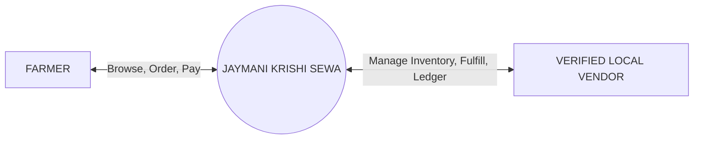
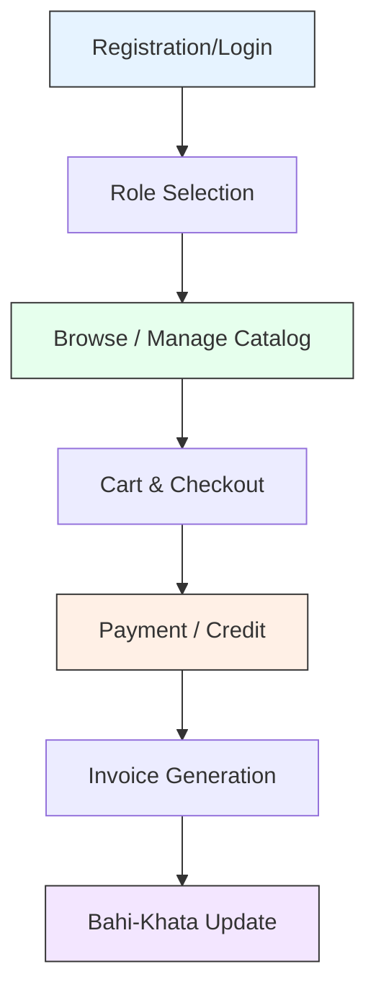
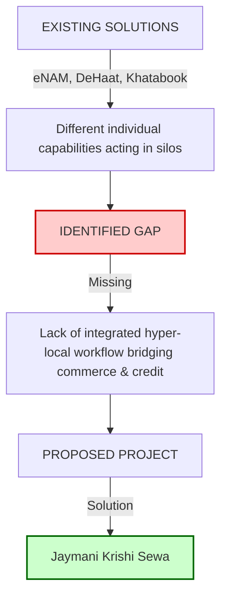
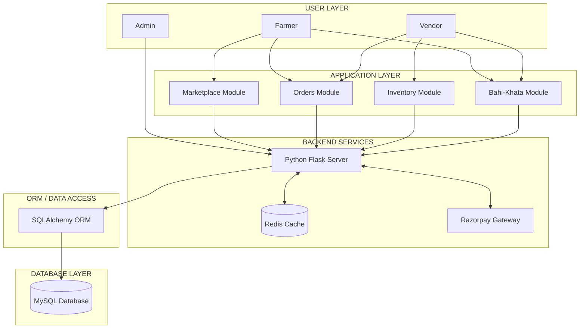
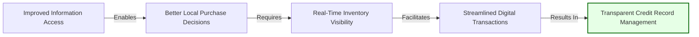

  
  <h1 style="color: #004d00; font-size: 3em; margin-bottom: 5px;">JAYMANI KRISHI SEWA</h1>
  <h2 style="color: #003366; font-size: 1.5em; margin-top: 0;">Digital Agritech Marketplace for Farmers & Local Vendors</h2>
  
     
  
  <h3 style="font-size: 1.5em;">Project Proposal Report</h3>
  
Submitted in partial fulfillment of the requirements for:

  
  <h3 style="font-size: 1.5em; color: #003366;"><strong>CSCR2600 — Project Based Learning</strong></h3>
  
     
  
  <h2 style="font-size: 1.8em; color: #003366;"><strong>Sharda University</strong></h2>
  <h3 style="font-size: 1.4em;">School of Computer Science & Engineering</h3>
  
      
  
  

    

      <h4 style="font-size: 1.2em; color: #004d00;">Submitted By</h4>
      
Manish Pandey

      
Jayant Raj

    

    

      <h4 style="font-size: 1.2em; color: #004d00;">Under the Guidance of</h4>
      
Prof. (Dr.) Ali Imam Abidi

    

  

---

## 2. CERTIFICATE

  

This is to certify that the Project Proposal Report titled **"JAYMANI KRISHI SEWA: Digital Agritech Marketplace for Farmers & Local Vendors"** submitted by **Manish Pandey** and **Jayant Raj** in partial fulfillment of the requirements for the course **CSCR2600 — Project Based Learning** at **Sharda University, School of Computer Science & Engineering**, is a bona fide record of the work proposed and carried out under my guidance and supervision.

     

  

    
___________________________

    
<strong>Prof. (Dr.) Ali Imam Abidi</strong>

    
Faculty Mentor

  

  

    
___________________________

    
<strong>Head of Department</strong>

    
School of Computer Science & Engineering

  

  

<strong>Date:</strong> _________________

<strong>Place:</strong> Sharda University, Greater Noida

---

## 3. DECLARATION

  

We hereby declare that the project proposal titled **"JAYMANI KRISHI SEWA: Digital Agritech Marketplace for Farmers & Local Vendors"** submitted for the course **CSCR2600 — Project Based Learning** at the School of Computer Science & Engineering, Sharda University, is an original work prepared by us for academic purposes. 

This proposal represents our independent thoughts and ideas. The sources of information and references used in the preparation of this report have been duly acknowledged. 

    

  

    
___________________________

    
<strong>Manish Pandey</strong>

  

  

    
___________________________

    
<strong>Jayant Raj</strong>

  

  

<strong>Date:</strong> _________________

---

## 4. ACKNOWLEDGEMENT

  

We would like to express our deepest appreciation and gratitude to all those who provided us the possibility to complete this project proposal.

We are highly indebted to our Faculty Mentor, **Prof. (Dr.) Ali Imam Abidi**, for his continuous guidance, encouragement, and invaluable feedback throughout the conceptualization of this project.

We would also like to extend our sincere thanks to the **School of Computer Science & Engineering** and the administration of **Sharda University** for providing us with the academic environment, resources, and platform to undertake this project based learning initiative.

Finally, we express our heartfelt gratitude to our fellow team members, peers, and everyone who directly or indirectly supported us during the research and preparation of this proposal.

   
**Manish Pandey**  
**Jayant Raj**

---

## 5. ABSTRACT

Farmers frequently face significant challenges in the local agricultural supply chain, primarily dealing with local price fluctuations, stock uncertainty, and the limitations of traditional, paper-based *Bahi-Khata* (credit ledgers). These inefficiencies lead to wasted time, increased fuel costs, and potential crop losses due to delayed access to essential agricultural inputs. 

This report proposes **Jaymani Krishi Sewa**, a digital agritech marketplace designed to bridge the gap between farmers and verified local vendors. The platform acts as a hyper-local ecosystem providing real-time inventory visibility, localized product discovery, and transparent purchasing mechanisms. Furthermore, it integrates a digital *Bahi-Khata* system, replacing manual credit records with accurate digital ledgers, automated invoices, and seamless payment options. 

By connecting demand with local supply through a centralized digital interface, Jaymani Krishi Sewa aims to reduce transaction friction and enhance operational transparency. The expected impact includes streamlined local commerce, improved credit management for vendors, and a significant reduction in unnecessary travel for farmers.

### Keywords
Agritech, Digital Marketplace, Farmers, Local Retailers, Inventory Management, Bahi-Khata, Agricultural Technology.

---

## 6. INTRODUCTION

### 6.1 Background
Access to quality agricultural supplies at the right time and at fair prices is a fundamental requirement for successful farming. In many rural and semi-urban areas, local agricultural markets serve as the primary source for seeds, fertilizers, and equipment. However, the connection between local farmers and these retailers often relies on inefficient, traditional methods.

### 6.2 The Current Landscape
Farmers heavily depend on local markets but face significant hurdles. Without prior knowledge of stock availability or comparative pricing, farmers are forced to physically travel between multiple shops. Concurrently, transactions between farmers and local vendors heavily rely on trust and credit, traditionally maintained in paper-based ledgers (*Bahi-Khatas*). These manual systems are prone to errors, loss, and disputes.

### 6.3 Motivation for Jaymani Krishi Sewa
Digital platforms have revolutionized various sectors, yet hyper-local agricultural commerce remains largely underserved. There is an urgent need for an ecosystem tailored specifically for this localized interaction. **Jaymani Krishi Sewa** is conceptualized to solve these grassroots-level inefficiencies by introducing a transparent, digital, and hyper-local marketplace that integrates product discovery, inventory management, and digital credit recording into a single platform.

---

## 7. PROBLEM STATEMENT — PO1

The existing process for procuring agricultural inputs at the local level is plagued by systemic inefficiencies that negatively impact both farmers and local agricultural retailers. The core issues include:

### 7.1 Price & Stock Uncertainty
Farmers often travel to multiple shops or adjacent towns without knowing the availability of specific products or their current local prices, leading to a trial-and-error approach to purchasing.

### 7.2 Paper Bahi-Khata
Local credit transactions are primarily recorded in manual, paper-based ledgers. These records can be difficult to track, prone to miscalculation, challenging to update in real-time, and highly susceptible to physical damage or loss.

### 7.3 Time & Fuel Loss
Inefficient access to agricultural inputs creates avoidable travel. The friction caused by physically searching for supplies wastes valuable time, especially critical during sowing seasons, and increases fuel expenses.

### 7.4 Vendor Limitations
Local agricultural retailers lack access to simple, affordable digital tools designed for their specific workflows. They struggle with managing inventory, updating prices dynamically, and maintaining organized customer credit histories.

### 7.5 Core Problem
**There is a need for a simple hyper-local platform connecting farmers with verified local agricultural retailers while combining product discovery, inventory visibility, purchasing, and digital credit records.**

---

## 8. PROBLEM ANALYSIS / 5W1H

To fully understand the dimensions of the problem, a 5W1H (Who, What, Where, When, Why, How) analysis has been conducted.

| Dimension | Description |
| :--- | :--- |
| **WHO?** | Small-scale farmers and local agricultural retailers. |
| **WHAT?** | Information gap in agricultural product supply, pricing, and credit records. |
| **WHERE?** | Rural and local agricultural markets. |
| **WHEN?** | Especially during critical agricultural and sowing seasons where time is a premium. |
| **WHY?** | To reduce unnecessary travel, financial uncertainty, and potential crop-related losses. |
| **HOW?** | Current practices depend heavily on phone calls, word-of-mouth, and manual paper records. |

---

## 9. OBJECTIVES

The primary objectives of the **Jaymani Krishi Sewa** project are:

1. **Digitize agricultural product buying:** Shift the local procurement process from a physical-first to a digital-first approach.
2. **Connect farmers with local vendors:** Create a trusted, verified network of local buyers and sellers.
3. **Provide local inventory and price visibility:** Allow farmers to view real-time stock levels and compare prices across local shops before traveling.
4. **Replace paper-based Bahi-Khata with digital records:** Implement a reliable, cloud-based ledger system for tracking credit and debits securely.
5. **Improve transaction transparency and invoicing:** Generate automated, digital invoices for every transaction to eliminate disputes.
6. **Provide a simple and accessible user interface:** Ensure the application is usable by individuals with varying levels of digital literacy.

---

## 10. PROPOSED PROJECT CONCEPT — PO4

**Jaymani Krishi Sewa** is conceptualized as a **Hyper-Local Digital Agritech Marketplace**. It serves as an integrated bridge connecting the demand side (farmers) with the supply side (local vendors) through a unified digital platform.

### 10.1 System Actors

**FARMER**
* Browse available agricultural products.
* Compare local prices across verified vendors.
* Check real-time stock availability.
* Place orders for pickup or local delivery.
* View digital invoices and transaction history.
* Manage and view personal credit (Bahi-Khata).

**VERIFIED VENDOR**
* Manage product catalog.
* Update stock levels dynamically.
* Update pricing based on market fluctuations.
* Manage incoming customer orders.
* Maintain and update the customer credit ledger.

**PLATFORM**
* Hosts the localized Marketplace.
* Facilitates Order routing.
* Tracks Inventory.
* Manages the Digital Bahi-Khata.
* Handles Payments and Digital Invoices.
* Enforces Role-based access and security.

### 10.2 Conceptual Diagram

---

## 11. PROPOSED SYSTEM WORKFLOW

The transaction lifecycle within Jaymani Krishi Sewa is designed to be seamless, ensuring data flows correctly from product discovery to the final ledger update. 

**Workflow Steps:**
1. **Registration/Login:** Secure authentication based on user roles (Farmer/Vendor).
2. **Role Selection:** Interface adapts based on the logged-in profile.
3. **Browse / Manage Catalog:** Farmers search for products; Vendors update their catalogs.
4. **Cart & Checkout:** Farmer selects products and proceeds to checkout.
5. **Payment / Credit:** Farmer chooses to pay via digital gateway (Razorpay) or requests local vendor credit.
6. **Invoice Generation:** An automated digital invoice is generated for the transaction.
7. **Bahi-Khata Update:** The digital ledger is automatically updated if the transaction involves credit, reflecting the new balance for both the farmer and the vendor.

### System Workflow Diagram

---

## 12. KEY FEATURES

The platform is divided into robust functional modules to serve its specific user base effectively.

| Feature | Purpose | Primary User |
| :--- | :--- | :--- |
| **Farmer Module** | Discovery, purchasing, and personal account tracking. | Farmer |
| **Vendor Module** | Store management, product listings, and order fulfillment. | Vendor |
| **Admin Module** | Platform oversight, vendor verification, and system health. | Administrator |
| **Product Marketplace** | Centralized hub for localized product listings and price comparisons. | Farmer / Vendor |
| **Inventory Management** | Real-time stock tracking and low-stock alerts. | Vendor |
| **Digital Bahi-Khata** | Secure, automated digital ledger replacing paper records. | Farmer / Vendor |
| **Razorpay Integration** | Secure digital payments (UPI, Cards, Netbanking). | Farmer |
| **Digital Invoice Gen** | Automated, verifiable receipts for transparency. | Farmer / Vendor |
| **Auth & Security** | Role-based access control and secure data handling. | All Users |

---

## 13. LITERATURE SURVEY — PO5

A review of existing agricultural technology solutions highlights the current state of the industry and helps pinpoint areas lacking innovation.

### 13.1 eNAM (National Agriculture Market)
* **Main focus:** A pan-India electronic trading portal networking existing APMC mandis to create a unified national market for agricultural commodities.
* **Identified limitation:** Primarily focused on wholesale market integration and bulk selling by farmers. Local retail inventory and micro-credit for farmers buying inputs are outside its core scope.
* **Jaymani response:** Focuses on hyper-local retailer discovery and local stock visibility for input procurement.

### 13.2 Digital Green
* **Main focus:** Uses technology and digital tools to empower farmers with knowledge, focusing on extension services and advisory.
* **Identified limitation:** Strong advisory and knowledge-sharing orientation; it does not provide a local retail checkout or transactional ledger system.
* **Jaymani response:** Focuses purely on localized commerce, inventory visibility, and transaction records.

### 13.3 DeHaat
* **Main focus:** A full-stack agricultural services platform offering a broad ecosystem from inputs to advisory and market linkage.
* **Identified limitation:** It operates as a broad, managed ecosystem. Independent, existing local vendor workflows and their localized micro-economies may differ by context and need decentralized tools.
* **Jaymani response:** Empowers existing verified local retailers with software to manage their own inventory and customers digitally.

### 13.4 Digital Bahi-Khata Applications (e.g., Khatabook)
* **Main focus:** Electronic credit records for small businesses.
* **Identified limitation:** Generic ledger tools that are completely disconnected from the actual product catalog, inventory, and automated purchasing workflows.
* **Jaymani response:** Integrates the Bahi-Khata directly with agricultural product orders, invoices, and payments in one unified flow.

---

## 14. RESEARCH GAP — PO5

The literature survey reveals that while excellent solutions exist, they address fragmented parts of the agricultural ecosystem. Wholesale markets, advisory services, and generic ledger apps operate in silos.

The identified opportunity and research gap is the integration of these specific elements into a seamless experience. 

The gap is the lack of a system that combines:
* **Hyper-Local Retail Discovery**
* **Inventory Visibility**
* **Product Purchasing**
* **Digital Invoicing**
* **Digital Bahi-Khata**

into one unified, localized workflow.

### Research Gap Diagram

---

## 15. PROJECT FEASIBILITY — PO2

### 15.1 Technical Feasibility
The project is technically highly feasible. It relies on proven, modern web technologies: HTML, CSS, JavaScript for the frontend; Python Flask for backend logic; MySQL with SQLAlchemy ORM for robust data management; Redis for caching; and Docker for consistent deployment environments.

### 15.2 Economic Feasibility
As a software-first solution, the capital required for hardware is minimal. The project utilizes open-source technologies (Python, MySQL, Redis) and commonly available development tools, making it highly economically viable to develop and prototype without significant financial overhead.

### 15.3 Operational Feasibility
The system is designed with specific role-based workflows for Farmers, Vendors, and Administrators. By mimicking familiar concepts (like the traditional Bahi-Khata) in a digital format, the operational transition for users is designed to be intuitive, ensuring high operational feasibility in a real-world scenario.

### 15.4 Schedule Feasibility
The development is staged systematically: Research → Requirements → UI/UX → Backend → Frontend → Integration → Testing → Deployment. This phased approach ensures steady progress and allows for iterative testing, making the project schedule realistic and manageable within the academic timeframe.

**Conclusion:** The Jaymani Krishi Sewa project is feasible across technical, economic, operational, and scheduling parameters.

---

## 16. TECHNOLOGY STACK

| Layer | Technology | Purpose |
| :--- | :--- | :--- |
| **Frontend** | HTML, CSS, JavaScript | Creating a responsive, accessible user interface. |
| **Backend** | Python Flask | Handling core application logic and API routing. |
| **Database** | MySQL | Reliable, relational data storage for users, orders, and ledgers. |
| **ORM** | SQLAlchemy | Bridging object-oriented backend logic with the relational database. |
| **Caching** | Redis | Caching sessions and catalog data for improved performance. |
| **Payments** | Razorpay | Processing secure digital payments. |
| **Deployment** | Docker | Containerizing the application for consistent environment execution. |
| **Web Server** | Nginx | Serving static files and acting as a reverse proxy. |
| **App Server** | Gunicorn | WSGI HTTP Server for UNIX to run the Flask application. |

---

## 17. SYSTEM ARCHITECTURE

The platform employs a structured, multi-tier architecture to ensure separation of concerns, scalability, and maintainability.

### Architecture Diagram

* **User Layer:** Client interfaces accessed via web browsers.
* **Application Layer:** Modular functional components handling specific business workflows.
* **Backend Services:** The core processing engine (Flask) interacting with auxiliary services like caching and payment gateways.
* **ORM/Data Access:** Abstraction layer for secure database interactions.
* **Database Layer:** Persistent storage of system state.

---

## 18. FUNCTIONAL REQUIREMENTS

### 18.1 Farmer Requirements
* **Authentication:** Registration and login capabilities.
* **Browsing:** Ability to view the product catalog and search by category/name.
* **Visibility:** Real-time viewing of product prices and stock availability across different local vendors.
* **Cart & Order:** Ability to add items to a cart and place an order.
* **Payment:** Option to pay online or request vendor credit.
* **Records:** Access to view past invoices and current Bahi-Khata standing.

### 18.2 Vendor Requirements
* **Authentication:** Secure login for verified vendors.
* **Catalog Management:** Add, edit, or remove products from their digital storefront.
* **Inventory Control:** Update stock levels and modify prices dynamically.
* **Order Management:** Accept, process, and fulfill incoming farmer orders.
* **Ledger Management:** View and update the digital Bahi-Khata for individual customers.

### 18.3 Admin Requirements
* **User Management:** Oversee farmer registrations and resolve access issues.
* **Vendor Management:** Verify and onboard new local vendors to ensure platform trustworthiness.
* **Platform Monitoring:** Track system health, transaction volumes, and categorical data.

---

## 19. NON-FUNCTIONAL REQUIREMENTS

* **Usability:** The interface must be highly intuitive, utilizing clear iconography and simple navigation, catering to users who may have limited digital fluency.
* **Security:** Sensitive data, including passwords and transaction records, must be encrypted. Role-based access control must strictly prevent unauthorized data manipulation.
* **Performance:** Product searches and catalog loading must be optimized (using Redis) to ensure fast response times.
* **Reliability:** The database architecture must ensure ACID properties to prevent data corruption during financial/credit transactions.
* **Responsive Design:** The web application must be fully responsive, functioning flawlessly on both desktop and mobile devices.
* **Low-Bandwidth Awareness:** Frontend assets should be optimized and minified to accommodate rural areas with potentially unstable or slow internet connectivity.

---

## 20. PROJECT ROADMAP — PO11

The project will be executed in 8 distinct phases:

| Phase | Description | Estimated Time |
| :---: | :--- | :--- |
| **1** | **Problem Identification & Research:** Literature survey, problem definition, and feasibility analysis. | Weeks 1-2 |
| **2** | **Requirement Analysis:** Finalizing functional/non-functional requirements and technology stack. | Weeks 3-4 |
| **3** | **UI/UX Design:** Creating wireframes, mockups, and finalizing the visual theme. | Weeks 5-6 |
| **4** | **Database & Backend Development:** Schema design, SQLAlchemy setup, and core Flask API routing. | Weeks 7-8 |
| **5** | **Frontend Development:** HTML/CSS/JS implementation and integration with backend APIs. | Weeks 9-10 |
| **6** | **Payment & Bahi-Khata Integration:** Razorpay implementation and finalizing the digital ledger logic. | Weeks 11-12 |
| **7** | **Testing & Security:** Unit testing, vulnerability checks, and bug resolution. | Week 13 |
| **8** | **Deployment & Final Presentation:** Dockerization, hosting, and preparation of final reports. | Week 14 |

---

## 21. DISTRIBUTION OF WORK — PO11

To ensure efficient execution, responsibilities have been divided while maintaining collaborative overlap on critical phases.

### MANISH PANDEY
**Primary Responsibilities:**
* Project Research & Literature Survey
* Requirement Gathering & Analysis
* Project Documentation and Report Generation

**Supporting Responsibilities:**
* System Architecture Planning
* Technical Presentation
* Quality Assurance Testing

### JAYANT RAJ
**Primary Responsibilities:**
* UI/UX Design and Prototyping
* Frontend Development
* Application/Backend Logic Development

**Supporting Responsibilities:**
* Database Design and API Integration
* Containerization and Deployment

*Note: Both members will collaborate intensively on system integration, end-to-end testing, and the final project presentation.*

---

## 22. EXPECTED OUTCOMES

### For Farmers
* Significant reduction in unnecessary travel and fuel costs.
* Transparent visibility into local product availability and pricing.
* Secure, immutable digital transaction records.
* Simplified and transparent credit tracking.

### For Vendors
* Enhanced visibility of their inventory to a wider local audience.
* Centralized and automated customer ledger management.
* Streamlined order processing reducing in-shop chaos during peak seasons.
* Better traceability of historical transactions.

### For the Ecosystem
* Transition from undocumented paper transactions to transparent digital records.
* Stimulation of hyper-local commerce through digital connectivity.
* Establishment of a scalable architecture that can adapt to future agricultural needs.

---

## 23. FUTURE SCOPE

*These features are identified for future enhancements and are beyond the scope of the current initial release.*

* **Mobile Applications:** Development of dedicated Android/iOS applications for enhanced accessibility.
* **Offline Synchronization:** Allowing vendors to update ledgers offline, syncing automatically when connectivity returns.
* **Regional Voice Search:** Implementing Hindi/Bhojpuri voice-assisted search to accommodate varying literacy levels.
* **Predictive Analytics:** Utilizing AI to provide predictive inventory suggestions to vendors based on seasonal demand trends.
* **Advisory Integration:** Offering real-time weather updates, fertilizer recommendations, and crop advisory.

---

## 24. LIMITATIONS

* **Vendor Adoption:** The platform's accuracy relies entirely on vendors maintaining up-to-date inventory and price data.
* **Connectivity constraints:** Continuous internet access is required, which may be a limitation in deeper rural zones.
* **Digital Literacy:** Initial onboarding may require a learning curve for users completely unfamiliar with e-commerce platforms.
* **Geographic Coverage:** Initial implementation and testing will be limited to specific, localized test markets.

---

## 25. EXPECTED IMPACT

The project aims to create a ripple effect of efficiency throughout the local agricultural supply chain.

### Impact Chain

---

## 26. CONCLUSION

The agricultural sector relies heavily on local retail networks, yet these micro-economies operate with significant informational friction. The proposed solution, **Jaymani Krishi Sewa**, addresses these grassroots challenges by providing a dedicated, hyper-local digital layer. By seamlessly connecting local agricultural demand, supply, inventory tracking, purchasing, payments, and credit records into a unified platform, the project demonstrates high feasibility and significant potential for positive operational impact. The integrated digital *Bahi-Khata* modernizes traditional trust-based economics, paving the way for a more efficient, transparent, and connected local agricultural ecosystem.

---

## 27. REFERENCES / BIBLIOGRAPHY

1. Government of India. (n.d.). *National Agriculture Market (eNAM)*. Retrieved from [Reference details to be verified before final submission]
2. Digital Green. (n.d.). *Empowering Farmers through Digital Technology*. Retrieved from [Reference details to be verified before final submission]
3. DeHaat. (n.d.). *Technology-Based Solutions for the Agricultural Sector*. Retrieved from [Reference details to be verified before final submission]
4. Pallet, A., & Smith, J. (2021). *The Digitization of Micro-Credit in Rural Markets*. Journal of Rural Technology. [Reference details to be verified before final submission]
5. Grinberg, M. (2018). *Flask Web Development: Developing Web Applications with Python*. O'Reilly Media.
6. McKinney, W. (2022). *Python for Data Analysis*. O'Reilly Media.

---

## 28. APPENDIX

**A.1 Glossary of Terms**
* **Bahi-Khata:** Traditional Indian term for a ledger or account book used for maintaining financial records and credit.
* **Agritech:** Agricultural technology; the use of technology to improve efficiency and profitability in agriculture.
* **Hyper-local:** Pertaining to a very specific, small geographical area, typically on the scale of a community or neighborhood.

**A.2 Technologies Referenced**
* Python 3.x
* Flask Framework
* MySQL Server
* Redis In-Memory Datastore
* Docker Engine
* HTML5 / CSS3 / JavaScript (ES6+)

*(Additional diagrams, UI mockups, and codebase architecture will be appended in subsequent evaluation phases as development progresses).*
