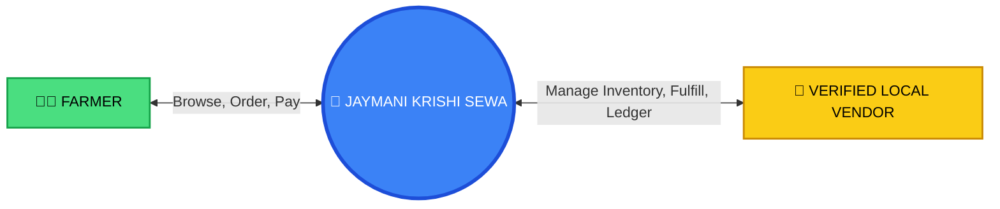
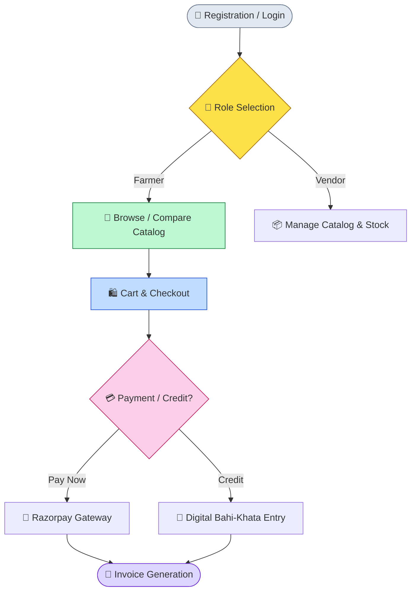
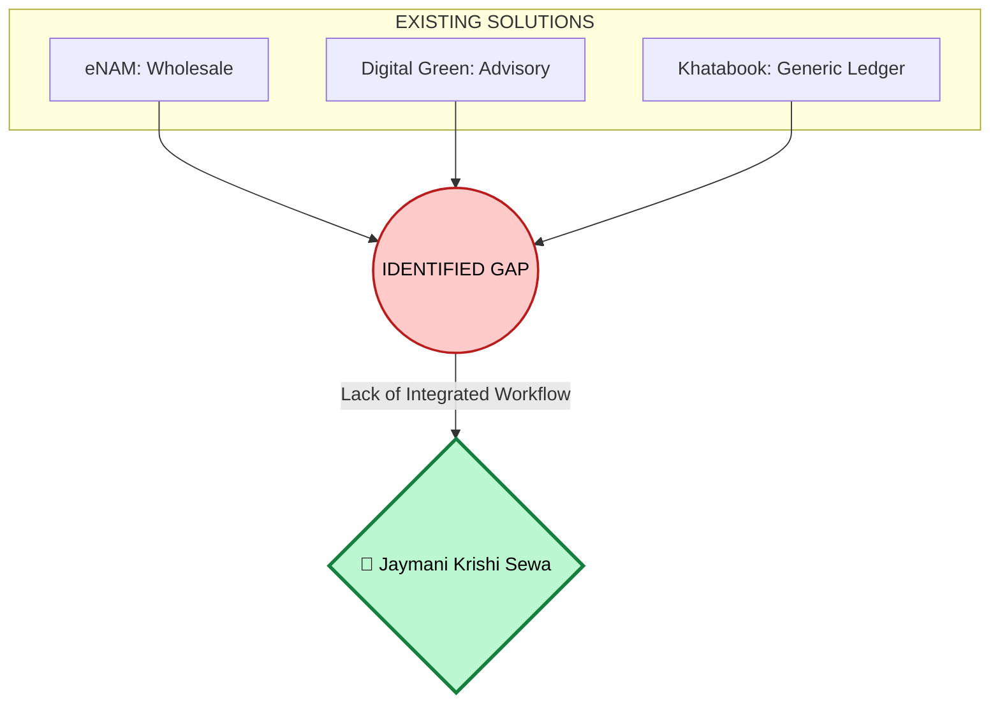
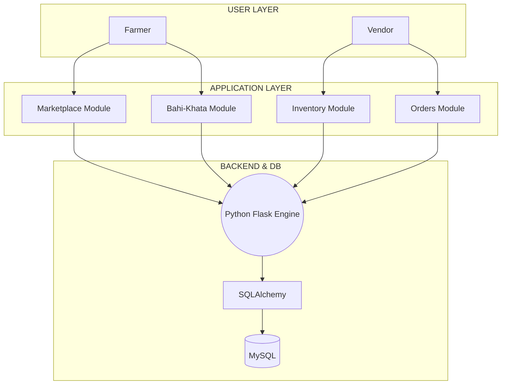

  <h1 style="font-size: 3.5em; margin-bottom: 5px; color: #4ade80; text-shadow: 2px 2px 4px rgba(0,0,0,0.5);">🌾 JAYMANI KRISHI SEWA 🌾</h1>
  <h2 style="font-size: 1.8em; font-weight: 300; margin-top: 0; color: #f8fafc;">Digital Agritech Marketplace for Farmers & Local Vendors</h2>
  
    
  

    <h3 style="font-size: 1.6em; margin: 0; color: #fbbf24;">Project Proposal Report</h3>
    
Submitted in partial fulfillment of the requirements for:

    <h3 style="font-size: 1.5em; color: #38bdf8; margin: 5px 0;"><strong>CSCR2600 — Project Based Learning</strong></h3>
  

     
  
  <h2 style="font-size: 2em; color: #f8fafc;"><strong>Sharda University</strong></h2>
  <h3 style="font-size: 1.3em; font-weight: 300;">School of Computer Science & Engineering</h3>

  

  

    <h4 style="font-size: 1.3em; color: #1e293b; margin-bottom: 5px;">👨‍🎓 Submitted By:</h4>
    
Manish Pandey

    
Jayant Raj

  

  

    <h4 style="font-size: 1.3em; color: #1e293b; margin-bottom: 5px;">👨‍🏫 Under the Guidance of:</h4>
    
Prof. (Dr.) Ali Imam Abidi

  

---

  <h2 align="center" style="color: #0f172a;">📜 CERTIFICATE</h2>
   
  

    This is to certify that the Project Proposal Report titled <strong>"JAYMANI KRISHI SEWA: Digital Agritech Marketplace for Farmers & Local Vendors"</strong> submitted by <strong>Manish Pandey</strong> and <strong>Jayant Raj</strong> in partial fulfillment of the requirements for the course <strong>CSCR2600 — Project Based Learning</strong> at <strong>Sharda University, School of Computer Science & Engineering</strong>, is a bona fide record of the work proposed and carried out under my guidance and supervision.
  

     
  

    

      
___________________________

      
<strong>Prof. (Dr.) Ali Imam Abidi</strong>

      
Faculty Mentor

    

    

      
___________________________

      
<strong>Head of Department</strong>

      
School of Computer Science & Engineering

    

  

---

## 🚀 5. EXECUTIVE ABSTRACT

Farmers frequently face significant challenges in the local agricultural supply chain, primarily dealing with local price fluctuations, stock uncertainty, and the limitations of traditional, paper-based <em>Bahi-Khata</em> (credit ledgers). These inefficiencies lead to wasted time, increased fuel costs, and potential crop losses. 
  
This report proposes <strong>Jaymani Krishi Sewa</strong>, a digital agritech marketplace designed to bridge the gap between farmers and verified local vendors. The platform acts as a hyper-local ecosystem providing real-time inventory visibility, localized product discovery, and transparent purchasing mechanisms. 
  
Furthermore, it integrates a digital <em>Bahi-Khata</em> system, replacing manual credit records with accurate digital ledgers, automated invoices, and seamless payment options.

**Keywords:** `Agritech` `Digital Marketplace` `Farmers` `Local Retailers` `Inventory Management` `Bahi-Khata`

---

## 🎯 7. PROBLEM STATEMENT (PO1)

  
  

    <h3 style="color: #dc2626; margin-top: 0;">📉 7.1 Price & Stock Uncertainty</h3>
    
Farmers travel to multiple shops without knowing the availability of specific products or local prices, leading to a trial-and-error approach.

  

  

    <h3 style="color: #ea580c; margin-top: 0;">📒 7.2 Paper Bahi-Khata</h3>
    
Local credit transactions are primarily recorded in manual ledgers. These are difficult to track, prone to miscalculation, and easily lost.

  

  

    <h3 style="color: #7c3aed; margin-top: 0;">⏳ 7.3 Time & Fuel Loss</h3>
    
Inefficient access to agricultural inputs wastes valuable time (especially during sowing seasons) and increases fuel expenses.

  

  

    <h3 style="color: #16a34a; margin-top: 0;">🏬 7.4 Vendor Limitations</h3>
    
Retailers lack affordable digital tools to manage inventory, update prices dynamically, and maintain organized customer credit histories.

  

  <h3 style="color: #fbbf24; margin-top: 0;">💡 The Core Problem</h3>
  
There is a pressing need for a simple hyper-local platform connecting farmers with verified local agricultural retailers while combining product discovery, inventory visibility, purchasing, and digital credit records.

---

## 🔍 8. PROBLEM ANALYSIS (5W1H)

| Dimension | Analysis |
| :--- | :--- |
| 🧑 **WHO?** | Small-scale farmers and local agricultural retailers. |
| ❓ **WHAT?** | Information gap in agricultural product supply, pricing, and credit records. |
| 📍 **WHERE?** | Rural and local agricultural markets. |
| ⏰ **WHEN?** | Especially during critical agricultural and sowing seasons. |
| 🎯 **WHY?** | To reduce unnecessary travel, financial uncertainty, and potential crop-related losses. |
| 🛠️ **HOW?** | Current practices depend heavily on phone calls, word-of-mouth, and manual paper records. |

---

## 🌟 10. PROPOSED PROJECT CONCEPT (PO4)

**Jaymani Krishi Sewa** is conceptualized as a **Hyper-Local Digital Agritech Marketplace**. 

### System Actors:

1. **👨‍🌾 FARMER:** Browse products, compare prices, place orders, view invoices, and manage digital credit.
2. **🏬 VERIFIED VENDOR:** Manage catalog, update stock/prices dynamically, manage orders, and maintain the customer credit ledger.
3. **💻 PLATFORM:** Hosts the localized Marketplace, facilitates Order routing, tracks Inventory, and manages the Digital Bahi-Khata.

---

## 🔄 11. PROPOSED SYSTEM WORKFLOW

---

## 📚 14. RESEARCH GAP (PO5)

While platforms like *eNAM* focus on wholesale, *Digital Green* focuses on advisory, and *Khatabook* focuses on generic ledgers, **none provide an integrated hyper-local workflow bridging commerce and credit.**

---

## ⚙️ 16. TECHNOLOGY STACK

  

    <strong>🎨 Frontend:</strong> HTML5, CSS3, JS (Responsive UI)
  

  

    <strong>🧠 Backend:</strong> Python Flask
  

  

    <strong>🗄️ Database:</strong> MySQL & SQLAlchemy ORM
  

  

    <strong>⚡ Caching:</strong> Redis
  

  

    <strong>💳 Payments:</strong> Razorpay Integration
  

  

    <strong>🐳 Deployment:</strong> Docker & Nginx
  

---

## 🏗️ 17. SYSTEM ARCHITECTURE

---

## 📅 20. PROJECT ROADMAP (PO11)

  
<strong>Phase 1-2:</strong> Problem Identification & Requirement Analysis <em>(Weeks 1-4)</em>

  

  
  
<strong>Phase 3-4:</strong> UI/UX Design & Database/Backend Dev <em>(Weeks 5-8)</em>

  

  
  
<strong>Phase 5-6:</strong> Frontend & Payment/Bahi-Khata Integration <em>(Weeks 9-12)</em>

  

  
  
<strong>Phase 7-8:</strong> Testing, Security, Deployment & Presentation <em>(Weeks 13-14)</em>

  

---

## 👥 21. DISTRIBUTION OF WORK (PO11)

| Team Member | Primary Responsibilities | Supporting Responsibilities |
| :--- | :--- | :--- |
| 🧑‍💻 **Manish Pandey** | Project Research, Requirements Gathering, Documentation, Report Gen. | System Architecture Planning, QA Testing, Presentation |
| 🎨 **Jayant Raj** | UI/UX Design, Frontend Dev, Core Application/Backend Logic. | Database/API Integration, Docker Deployment |

---

## 🌍 25. EXPECTED IMPACT

---

## ✅ 26. CONCLUSION

**Jaymani Krishi Sewa** addresses grassroots agricultural challenges by providing a dedicated, hyper-local digital layer. By seamlessly connecting local demand, supply, inventory tracking, purchasing, payments, and credit records (Digital *Bahi-Khata*), the project demonstrates high feasibility and significant potential for positive operational impact. 

  <em>"Modernizing traditional trust-based economics for a more efficient agricultural ecosystem."</em>

