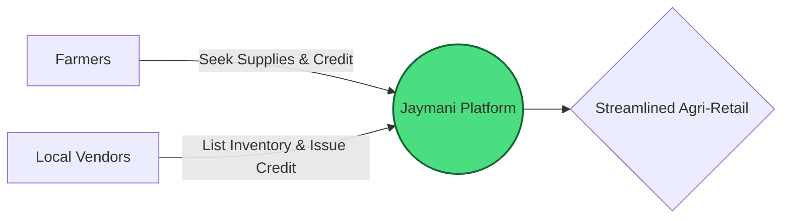
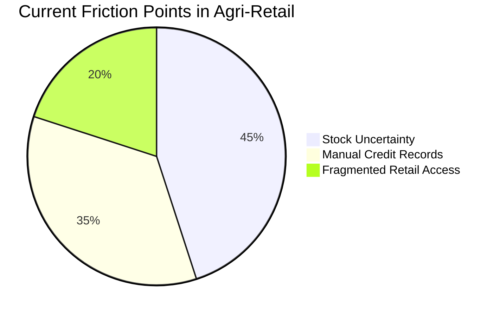
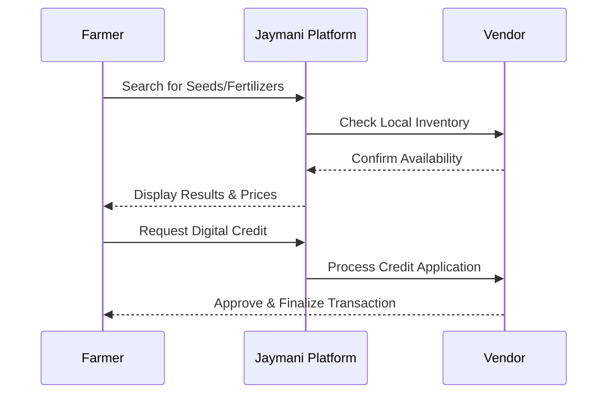
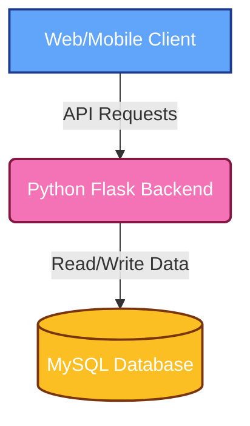
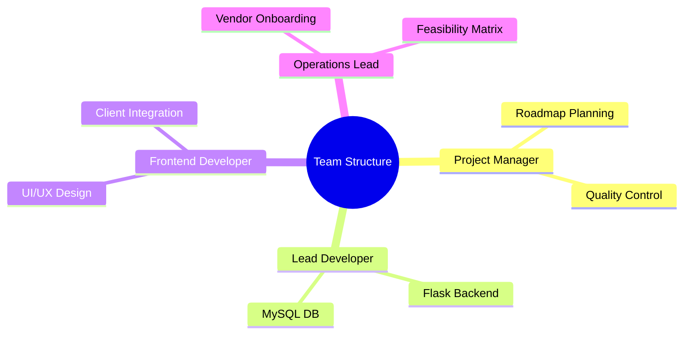

# Project Proposal Report: JAYMANI KRISHI SEWA
## Digital Agritech Marketplace for Farmers & Local Vendors

---

### 1. Executive Summary

**Jaymani Krishi Sewa** bridges the gap between farmers and local agricultural vendors by integrating hyper-local discovery, real-time inventory management, and digital credit into a unified platform.

> [!TIP]
> **Vision:** A modernized ecosystem that empowers local agriculture through digital connectivity.

---

### 2. Core Problem Statement

**Operational Friction in Agri-Retail**

Farmers face severe inefficiencies in their day-to-day operations.

> [!WARNING]
> **Key Issues:**
> 1. **Stock Uncertainty:** No real-time visibility into local retail inventory.
> 2. **Manual Credit Records:** Prone to disputes and poor financial tracking.
> 3. **Fragmented Access:** Hard to connect efficiently with vendors.

---

### 3. Proposed Solution

**End-to-End Operational Workflows**

*   **Hyper-Local Discovery:** Connect with nearby vendors easily.
*   **Inventory Management:** Digital stock verification in real-time.
*   **Digital Credit System:** Transparent, digital ledger tracking.

---

### 4. Technical Architecture

A robust, scalable architecture guarantees seamless marketplace and inventory operations.

---

### 5. Feasibility Analysis

Rigorously evaluated across a 4-part feasibility matrix:

| Viability Type | Status | Key Justification |
| :--- | :---: | :--- |
| 🛠️ **Technical** | ✅ | Leverages proven, scalable technologies (Flask/MySQL). |
| 💰 **Economical** | ✅ | Addresses high-demand market with sustainable costs. |
| ⚙️ **Operational** | ✅ | Clear, intuitive workflows for target demographic. |
| 📅 **Schedule** | ✅ | Realistic, milestone-driven phased approach. |

---

### 6. Development Roadmap

| Phase | Task |
| :--- | :--- |
| **Phase 1: Foundation** | Requirements & UI/UX |
| | Database Setup (MySQL) |
| **Phase 2: Core** | Backend API (Flask) |
| | Inventory Module |
| **Phase 3: Launch** | Digital Credit System |
| | Testing & Deployment |

---

### 7. Team Work Distribution

To maximize efficiency, the project workload has been strategically distributed. Each phase is managed by a dedicated owner with mutual accountability.

---

### 8. Conclusion & Impact

> [!IMPORTANT]
> Jaymani Krishi Sewa will transform the local agricultural retail landscape by eliminating stock uncertainties, digitizing financial records, and creating a cohesive marketplace. The end result is a highly efficient agricultural supply chain.
