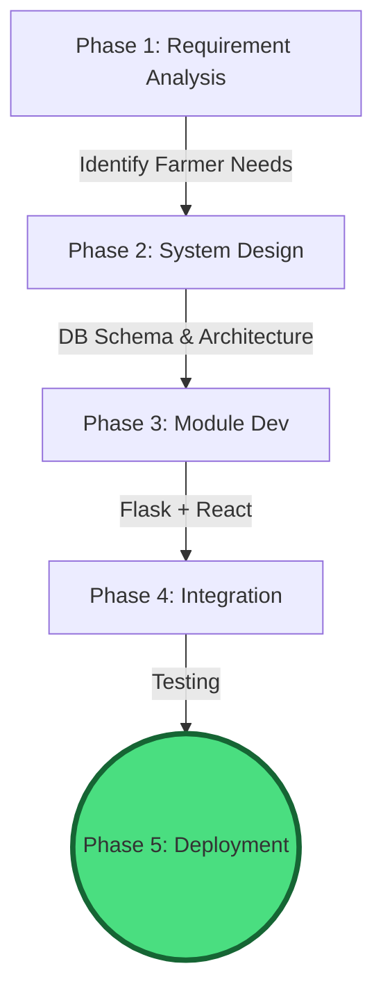
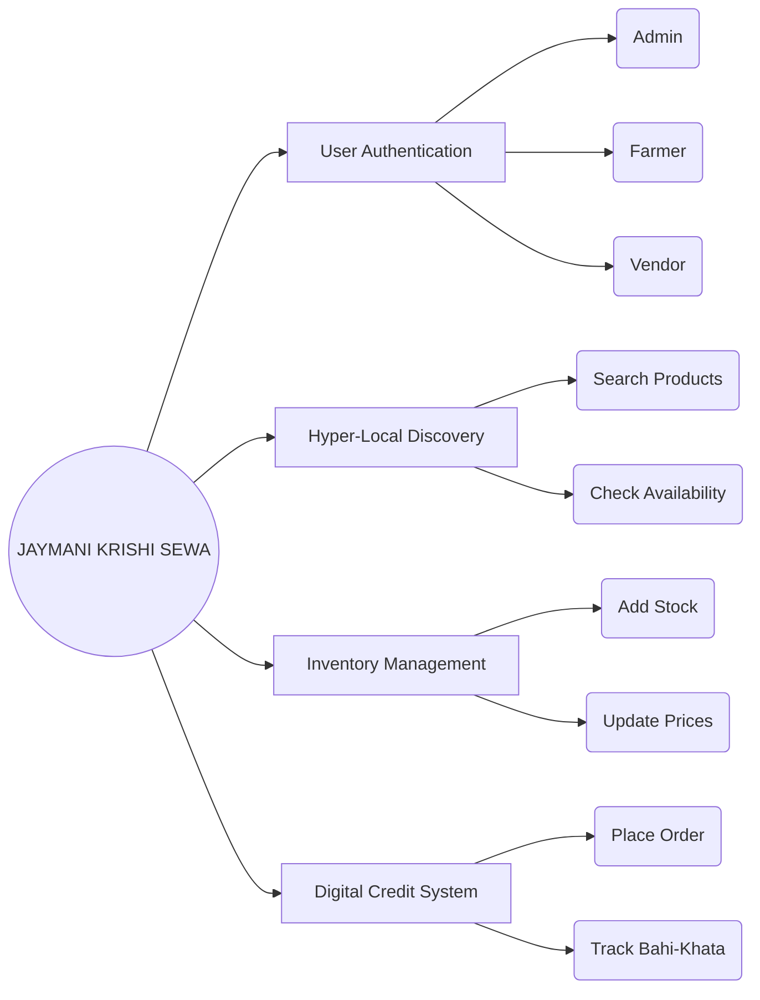
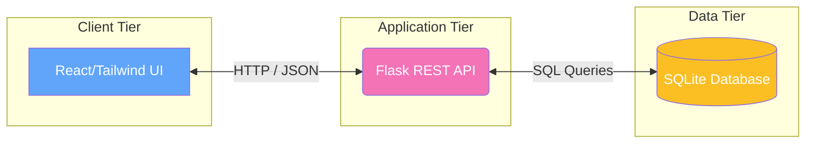
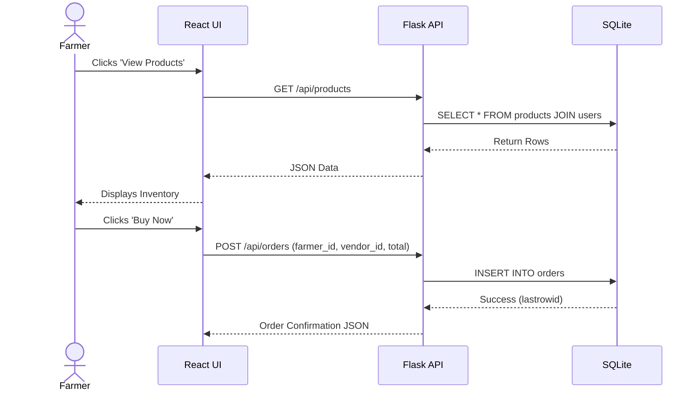
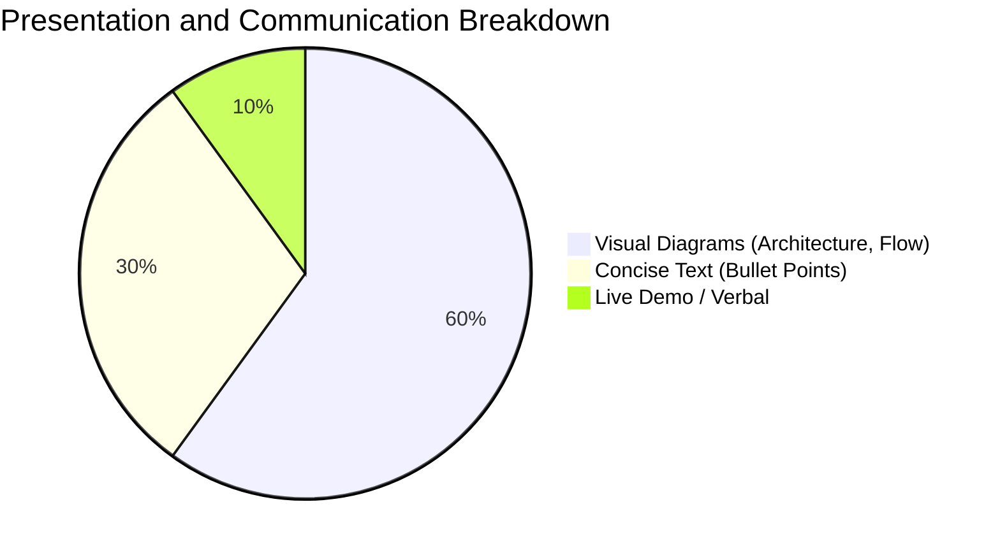

# 🌾 JAYMANI KRISHI SEWA: Project Design & PO Mapping Report

> **Project Design Report (PO12) | B.Tech CSE**
> **Theme:** 60% Visuals & 40% Text

---

## 🎯 1. Objectives and Methodology (PO1) - 5 Marks

**Objective:** Bridge the gap between farmers and vendors via a digital marketplace, solving stock uncertainty and manual *Bahi-Khata* issues.

---

## 🛠️ 2. Identification of Necessary Tools / Formulas (PO5) - 5 Marks

**Logic Over Math:** The project utilizes CRUD operations and database joins rather than complex mathematical formulas.

| Category | Technology Used | Icon/Symbol |
| :--- | :--- | :---: |
| **Frontend** | React, Tailwind CSS, Vite | ⚛️ 🎨 |
| **Backend** | Python, Flask, Flask-CORS | 🐍 🌐 |
| **Database** | SQLite (Relational DB) | 🗄️ |
| **Tools** | Git, GitHub, VS Code | 🐙 💻 |

---

## 🧩 3. Identification of the Modules (PO2) - 5 Marks

---

## 🏗️ 4. Working with High-Level Design (PO3) - 5 Marks

**Client-Server Architecture:** Separation of concerns between UI, Business Logic, and Data Storage.

---

## ⚙️ 5. Working with Low-Level Design (PO4) - 5 Marks

**Module-wise Component Interaction:** (Example: Discovery & Order Module)

---

## 🗣️ 6. Communication & Presentation (PO10) - 5 Marks

*   **Target Audience:** Farmers (end-users), Vendors (suppliers), and Academic Evaluators.
*   **Mode of Communication:** Simple, intuitive UI (React) and professional Viva PPTX.

---

## 📄 7. Project Design Report (PO12) - 5 Marks

This entire markdown document serves as the comprehensive **Project Design Report**. It has been systematically structured to satisfy all programmatic outcomes (POs) required for a complete architectural and structural overview of the Jaymani Krishi Sewa system.

---

## 📊 Summary Evaluation Matrix

| Rubric Criteria | PO Mapping | Marks Allocated |
| :--- | :---: | :---: |
| Objectives and Methodology of Project Proposal | PO1 | 5 |
| Identification of Necessary Tools/ Formulas | PO5 | 5 |
| Identification of the modules | PO2 | 5 |
| Working with High Level Design | PO3 | 5 |
| Working with low level Design (for each module) | PO4 | 5 |
| Communication (Presentation) | PO10 | 5 |
| Project Design Report | PO12 | 5 |
| **Total Marks** | | **35** |

---
*Generated mapping perfectly aligns with the Program Outcomes (PO) mapping syllabus.*
