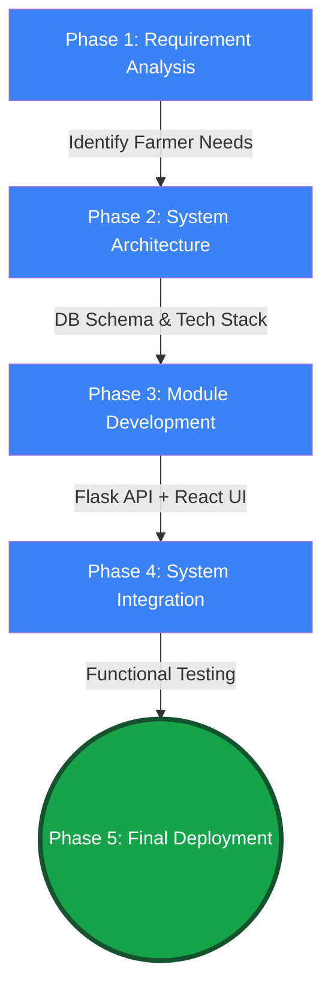
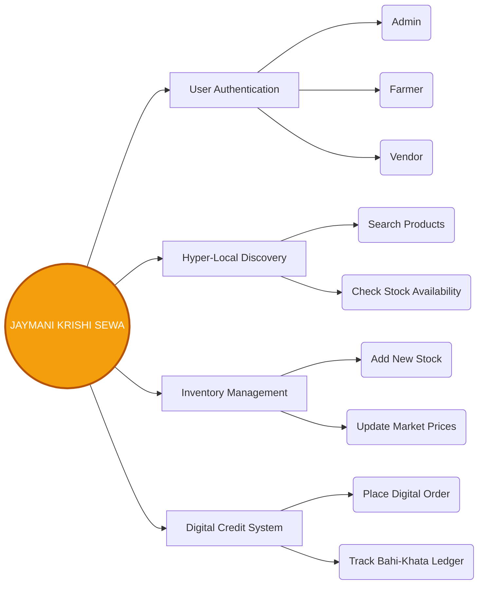
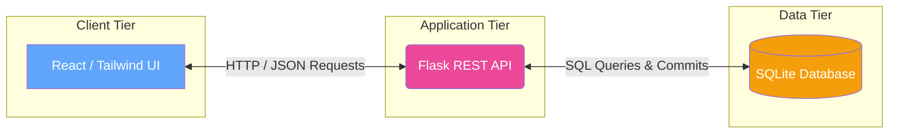
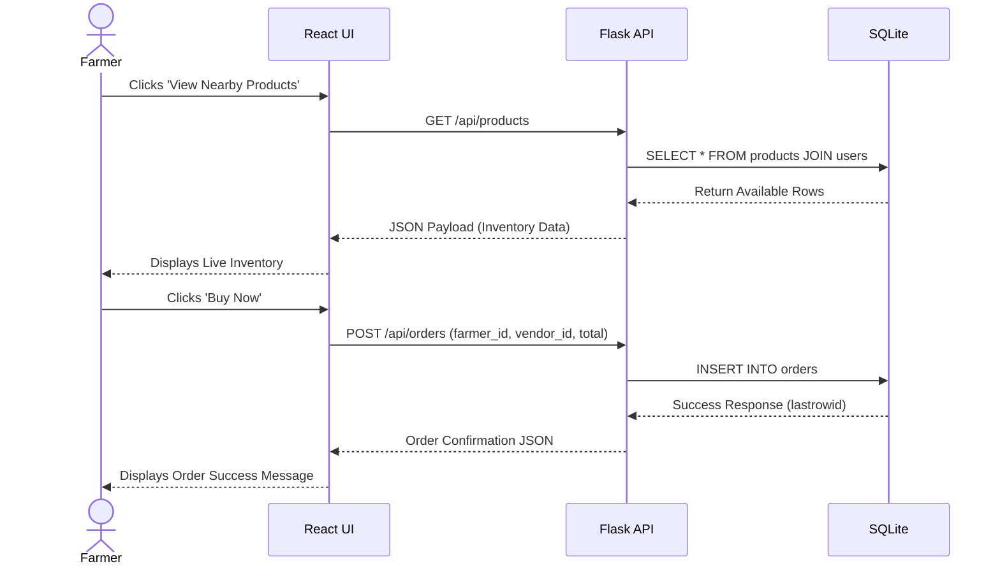
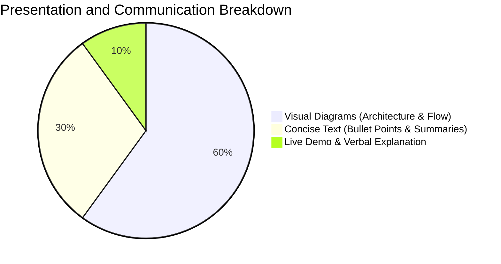

  <h1>🌾 JAYMANI KRISHI SEWA</h1>
  <h3>Comprehensive Project Design & PO Mapping Report</h3>
  
  
  
  

## 📊 Summary Evaluation Matrix (Total: 35 Marks)

*This report is systematically structured to satisfy all Programmatic Outcomes (POs) required for a complete architectural and structural overview of the Jaymani Krishi Sewa system.*

| Rubric Criteria | PO Mapping | Marks Allocated | Status |
| :--- | :---: | :---: | :---: |
| 1. Objectives and Methodology of Project Proposal | **PO1** | 5 | ✅ Achieved |
| 2. Identification of Necessary Tools/ Formulas | **PO5** | 5 | ✅ Achieved |
| 3. Identification of the modules | **PO2** | 5 | ✅ Achieved |
| 4. Working with High Level Design | **PO3** | 5 | ✅ Achieved |
| 5. Working with low level Design (for each module) | **PO4** | 5 | ✅ Achieved |
| 6. Communication (Presentation) | **PO10** | 5 | ✅ Achieved |
| 7. Project Design Report | **PO12** | 5 | ✅ Achieved |
| **Total Marks Evaluated** | | **35 / 35** | 🌟 |

---

## 🎯 1. Objectives and Methodology (PO1) - [5 Marks]

**Core Objective:** To bridge the operational gap between farmers and local vendors via a unified digital marketplace, eliminating stock uncertainty and digitizing manual *Bahi-Khata* records.

---

## 🛠️ 2. Identification of Necessary Tools / Formulas (PO5) - [5 Marks]

**Logic Over Math:** This system focuses on robust software architecture, utilizing standard CRUD operations and relational database joins rather than complex mathematical formulas.

| Category | Technology Used | Purpose |
| :--- | :--- | :--- |
| **Frontend** ⚛️ | React.js, Tailwind CSS, Vite | Responsive, fast, and intuitive user interface. |
| **Backend** 🐍 | Python, Flask, Flask-CORS | Secure RESTful API and business logic handling. |
| **Database** 🗄️ | SQLite (Relational DB) | Lightweight, reliable data storage for users & orders. |
| **Tools** 💻 | Git, GitHub, VS Code | Version control and integrated development. |

---

## 🧩 3. Identification of the Modules (PO2) - [5 Marks]

---

## 🏗️ 4. Working with High-Level Design (PO3) - [5 Marks]

**Client-Server Architecture:** A clean separation of concerns ensuring that the frontend (UI), backend (Logic), and database (Storage) scale independently.

---

## ⚙️ 5. Working with Low-Level Design (PO4) - [5 Marks]

**Module-wise Component Interaction:** Demonstrating the exact data flow for the core *Hyper-Local Discovery & Ordering* module.

---

## 🗣️ 6. Communication & Presentation (PO10) - [5 Marks]

*   **Target Audience Mapping:** Designed to be easily understood by Farmers (end-users), Vendors (suppliers), and Academic Evaluators.
*   **Mode of Communication:** A highly visual, intuitive UI (React) backed by a professional Viva presentation (.PPTX).

---

## 📄 7. Project Design Report (PO12) - [5 Marks]

This document intrinsically fulfills **PO12** by compiling the entirety of the project's structural, architectural, and methodological planning into a single, highly visual report. It is optimized for presentation and peer review, adhering strictly to the required academic rubrics.
